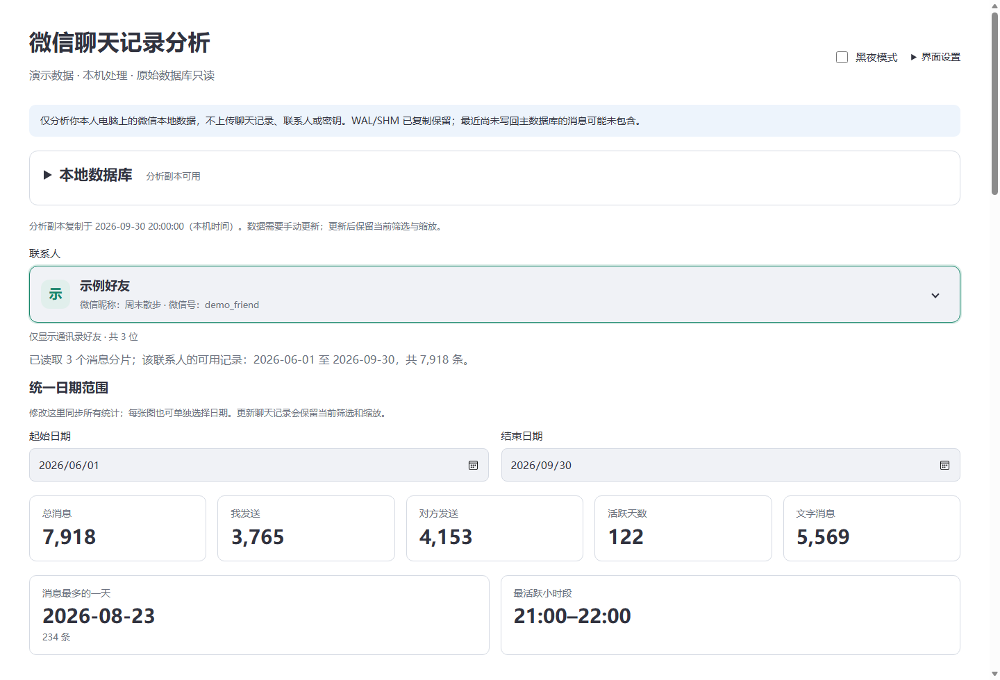
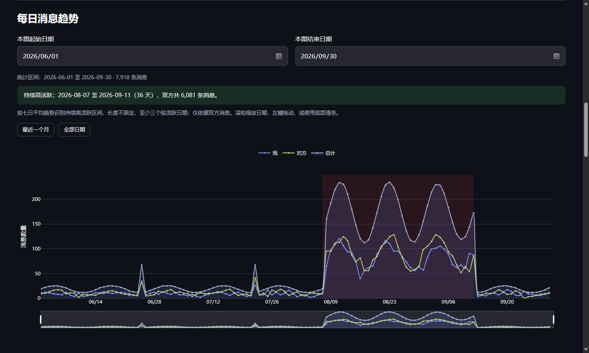

# 微信聊天记录分析 · 本地版

把电脑里的微信聊天记录，变成可浏览的时间趋势和基础统计。

这是一个在 **Windows 本机运行**的聊天分析工具：选择一位通讯录好友，就能查看聊天有多频繁、常在几点聊天、哪段时间最活跃，以及最长的文字消息。通过浏览器使用，无需注册账号。

**本机处理 · 原始数据库只读 · 不上传聊天记录 · 支持黑夜模式**

> 截图使用程序生成的演示数据，不包含真实联系人或聊天记录。

## 你可以用它做什么

- **查看聊天概况**：总消息数、双方发送数量、活跃天数、文字消息数、消息最多的一天、最活跃的小时段。
- **浏览聊天趋势**：按日查看「我 / 对方 / 总计」，默认聚焦最近一个月；滚轮缩放日期，按住左键拖动，也可以使用底部滑条浏览历史。
- **找到持续高活跃的日期**：自动标出聊天较密集的一段，长度不固定，并显示起止日期和消息数量。
- **观察聊天时间**：24 小时消息分布，以及红色的星期 × 小时热力图。每张图都能单独选择日期。
- **查看消息类型**：默认展示数量最多的三类，其余可展开查看；占比仍按全部类型计算。系统、位置、名片不列入类型表，引用次数单独统计。
- **查看最长文字**：默认折叠，展开可查看前 20 条，按字符数排序，支持普通文字和 zstd 压缩的长文本。
- **统计文字总量与高频词**：查看双方汉字数、所有字符数，以及出现最多的前 10 个词；始终统计所选联系人的全部可读取记录，不受日期筛选和图表缩放影响。
- **一键更新数据**：重新从微信目录复制并解析聊天记录，成功后替换分析副本；失败时保留原有可用数据。
- **记住使用习惯**：可分别开启主题、联系人、日期范围、图表缩放的记忆，下次打开继续使用。

联系人使用一个可搜索的选择框，**备注优先作为主名称，微信昵称和微信号在第二行显示**；支持方向键选择、回车确认和 Esc 收起。没有自定义微信号时显示内部 ID。聊天记录会跨所有消息数据库分片读取，没有固定的「2025 年以后」限制。

查看图表与黑夜模式

同一套界面支持浅色和黑夜模式，图表颜色随页面切换。演示截图中的日期和消息量均为合成数据。

## 运行条件

| 项目 | 当前支持情况 |
| --- | --- |
| 操作系统 | 已验证 Windows 11 |
| Python | 3.12，64 位 |
| 电脑版微信 | 已验证 **4.1.13.65** |
| 数据目录 | 微信 4.x 的 xwechat_files/账号/db_storage 结构 |
| 操作界面 | 本机浏览器，建议使用 Edge 或 Chrome |

其他微信版本可以尝试，页面会标记「未验证版本」，兼容性没有保证。目前没有 EXE 安装包，也不支持手机、macOS 或 Linux。

## 安装与启动

1. 下载本仓库的 ZIP 并解压，或使用 Git 克隆仓库。
2. 安装 **Python 3.12 64 位**。
3. 在项目文件夹中打开 PowerShell，执行：

~~~powershell
py -3.12 -m venv .venv
.\.venv\Scripts\python.exe -m pip install -r requirements.txt
.\.venv\Scripts\python.exe web_app.py
~~~

打开 **[http://127.0.0.1:8501](http://127.0.0.1:8501)** 即可使用。

安装依赖需要联网下载 Python 包；安装完成后，分析过程无需外部网络，图表脚本也由本机提供。网页通过本地 Python 服务运行，不能直接双击 HTML 文件使用。

以后启动只需在项目文件夹执行：

~~~powershell
.\.venv\Scripts\python.exe web_app.py
~~~

在启动终端按 **Ctrl+C** 停止服务。关闭网页不会停止程序。端口被占用时，先停止之前启动的服务，或换一个端口：

~~~powershell
.\.venv\Scripts\python.exe web_app.py --port 8502
~~~

此时打开 http://127.0.0.1:8502。

## 第一次使用

展开页面顶部的 **「本地数据库」**，按下面的顺序操作：

1. **确认微信版本**。程序优先检测运行中的 Weixin.exe；检测失败时可以手动输入。
2. **填写微信数据路径**。可以填写账号文件夹，也可以填写其 db_storage 子文件夹，例如：
   ~~~text
   D:\微信数据\xwechat_files\<账号>\db_storage
   ~~~
   目录应包含 contact/contact.db 和 message/message_*.db。中文和空格路径均可使用。
3. 点击 **「检测目录」→「创建分析副本」**。程序复制联系人库、全部消息分片及已有的 WAL/SHM 文件。
4. 保持对应账号的电脑版微信登录，点击 **「提取数据库密钥」**。密钥逐库验证，页面只显示是否成功，不展示完整密钥。
5. 点击 **「解密数据库」**。所有数据库通过完整性检查后，进入分析页面。
6. **搜索并选择联系人**，调整日期范围，开始查看统计。

首次扫描和解密可能需要几分钟，耗时取决于数据库大小。已有有效分析副本时，再次启动会检查并复用它，不需要每次重新初始化；此时微信关闭也可以继续分析。

### 日期与图表怎么用

顶部的 **「统一日期范围」**会同步更新指标、类型统计、三张图和最长文字，包含起止两天。

**「文字统计」始终使用当前联系人的全部可读取聊天记录**，日期范围和图表缩放不会影响它。总计、我发送、对方发送分别显示汉字数和所有字符数：汉字数只计汉字，包含扩展汉字；所有字符数按 Python `len(content)` 计算，包含字母、数字、标点、表情和正文内空白。

高频词只显示前 10 个，使用本地 jieba 分词，只保留至少两个字符的词，过滤单字、常见虚词、标点、纯数字和网址，保留「哈哈」「晚安」等聊天表达；重复出现的词按实际次数计数。只统计已识别双方的文字正文，排除拍一拍、系统和非文字消息，引用回复只计本次回复正文，不重复计算引用原文。普通文字中提到「拍一拍」仍计入。

首次读取联系人时自动计算，较多文字可能需要等待。结果只缓存在服务内存中；调整日期直接复用，切换联系人或更新聊天数据后重新计算，不需要 GPU。升级此功能后，请重新安装 `requirements.txt` 中的依赖并重启本机服务。

每张图上方还有独立的日期选择，只影响这一张图；再次修改统一范围时，三张图会重新同步。日期框右侧的 **「全选日期」**会选择该联系人的全部可读取日期：统一范围旁的按钮同步所有图表，本图旁的按钮只更新本图。文字统计始终使用全部历史。

每日趋势默认显示所选范围末尾的最近 30 天，下方「显示全部」只展开当前所选范围的时间轴。24 小时分布也支持通过日期时间轴缩放和拖动，柱状图会根据可见日期重新统计。

点击每日趋势图例中的 **「高活跃」**可以显示或隐藏红色区间及其说明。它根据当前图表日期范围内双方消息量的七日均线识别，以中位数作基准，寻找包含较高峰值、至少有三个较活跃日期的连续区间，再选消息总数最多的一段。区间长度不固定，允许短暂低谷；详细门槛可展开「高活跃如何计算？」查看。这只是消息趋势提示，不代表关系判断。

### 更新聊天记录

展开 **「本地数据库」**，点击 **「更新聊天记录」**。程序沿用之前选择的来源路径，重新复制、验证密钥、解密和检查，完成后自动刷新分析。

建议保持对应微信账号登录，并在更新期间暂停收发消息。更新后保留当前联系人；**如果某个日期范围的截止日期等于更新前该联系人的最后记录日期，会自动延长到更新后的最后日期**。手动选定的历史范围保持不变。图表视图原本停在最新日期时也会跟随新记录；原本浏览的历史区间保持不变。全程不选择未来日期。

「分析副本复制时间」是文件复制时间，不是聊天记录的起止时间。副本不会随微信实时更新。换账号或修正来源路径时，请使用「重新初始化」。

### 记住上次的状态

右上角 **「界面设置」**提供四个独立选项：记住主题、联系人、日期范围、图表缩放。

默认全部关闭。开启后保存当前状态，之后的操作会自动更新；关闭某项会清除该项的保存值。设置存放在本机 workspace/preferences.json，更新数据库不会覆盖它，同一电脑上的不同浏览器也可以读取。

## 数据范围与隐私

**程序仅分析你本人电脑上的微信本地数据。聊天记录、联系人、数据库与密钥均在本机处理，不上传。**

- 微信原始目录只允许读取和复制。密钥验证、解密、查询和统计都针对本项目工作区内的副本。
- 密钥从已登录的 Weixin.exe 中只读提取，不修改进程内存、不注入 DLL、不 Hook，也不发送消息。支持逐库独立的 32-byte / 48-byte key。
- 本地服务只监听 127.0.0.1。没有云同步、账号系统或在线分析服务。
- 工作区只保留一个当前版本和最多一个上一版；更新期间临时副本也会占用空间，请预留足够磁盘容量。
- **workspace 中有明文密钥和解密后的聊天数据库。请勿分享、上传、打包或放进云同步目录。** 工作区、数据库、密钥、日志、虚拟环境和本机设置默认由 .gitignore 排除。

### 当前的数据限制

- **只分析主 DB，不合并 WAL。** WAL/SHM 文件会随库复制，但最近尚未写回主数据库的消息可能未包含。
- 更早的聊天记录只有在本地数据库中存在时才能分析。选择更早日期不会恢复已删除、未同步或仅在手机上的记录。
- 联系人列表以已添加好友为主，排除群聊、公众号、系统账号及未添加的群成员。目前不做群聊分析。
- 图片、语音、视频等只统计消息类型，不读取媒体内容。红包、转账统计消息条数，不统计金额。
- 顶部总消息包含系统和发送者无法识别的消息；类型表排除系统、位置、名片。因此表内数量与顶部总数可能不同，双方发送数量之和也可能小于总数。
- 引用回复按本次回复自身的内容归类，引用次数作为附加统计，不重复增加总消息数。

## 常见问题

**找不到联系人库或消息库？**  
确认输入的是当前账号目录或 db_storage，里面应有 contact 和 message 子文件夹，不要选择微信程序的安装目录。

**未检测到 Weixin.exe，或某个数据库没有有效密钥？**  
先登录对应账号的电脑版微信，确认目录和版本正确。权限不足时检查两个程序的运行权限是否一致，必要时以管理员身份启动终端。

**解密失败或完整性检查失败？**  
暂停微信收发消息，重新创建副本后再试；同时确认微信版本是否为已验证版本。失败结果不会覆盖已有正常副本。

**为什么刚收到的消息没有显示？**  
先点击「更新聊天记录」，再检查日期筛选。若消息仍在 WAL 中、尚未写回主 DB，当前版本可能暂时读不到。

**为什么某位好友只有一小段日期？**  
页面显示的是这位好友在当前副本中的可用记录范围，不是整个账号的历史范围。请确认微信本地数据库确实保存了更早记录，并在导入历史后更新分析副本。

**遇到其他错误怎么办？**  
页面会显示操作失败原因，日志保存在 workspace/logs/app.log。反馈时请说明微信版本、操作步骤和错误提示；不要上传数据库、密钥、真实联系人或聊天正文。

## 项目说明

当前版本提供基础统计、三张图表、文字总量、高频词与最长文字查看，不包含 AI 分析、情感判断、词云、媒体解析、云同步或聊天导出。

新版入口为 **web_app.py**，使用 HTML、CSS、JavaScript、Flask 和 Plotly。原 Streamlit 入口仍保留备用：

~~~powershell
.\.venv\Scripts\python.exe -m streamlit run app.py
~~~

两个入口共用工作区，初始化和更新时请只运行其中一个。界面状态记忆仅在新版网页生效。

开发与测试

核心代码按目录识别、工作副本、密钥提取、解密、联系人、消息读取及统计分层。底层解析与解密沿用已经在真实环境验证的算法，运行不依赖开发者的参考目录。

~~~text
core/       数据库与微信数据读取
analysis/   基于 pandas 的基础统计
web/        本地接口、网页和界面设置
ui/         备用 Streamlit 界面
tests/      合成数据回归测试
~~~

在项目根目录运行测试：

~~~powershell
.\.venv\Scripts\python.exe -m unittest discover -s tests -v
~~~

测试使用合成数据，不需要真实微信数据库。

网页日期跟随、全选和高活跃开关另有轻量测试。如已安装 Node.js，可运行以下命令；Node.js 仅用于开发测试，启动产品无需安装：

~~~powershell
node tests/test_frontend.cjs
~~~

本项目为独立工具，与腾讯或微信官方无隶属关系。
